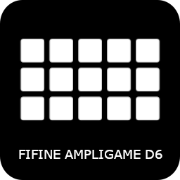

# OpenDeck FIFINE Ampligame D6

An unofficial OpenDeck plugin for the **FIFINE Ampligame D6** USB control pad.

This plugin allows the FIFINE Ampligame D6 to be used with [OpenDeck](https://github.com/nekename/OpenDeck), including button configuration and display support.

## Supported Devices

The plugin supports the following FIFINE Ampligame D6 hardware revisions:

| USB Vendor ID | USB Product ID | Protocol    |
| ------------- | -------------- | ----------- |
| `3142`        | `0007`         | Protocol v1 |
| `3142`        | `0060`         | Protocol v2 |

The `3142:0060` revision uses a different output protocol and 112×112 pixel button images.

## Requirements

* OpenDeck **2.5.0 or newer**
* FIFINE Ampligame D6
* Linux, macOS, or Windows

## Platform Support

### Linux

**Supported and tested.**

Linux is the primary development and testing platform for this plugin.

### macOS

**Best effort.**

The plugin includes macOS support, but hardware testing may be limited. Contributions and testing reports are welcome.

### Windows

**Best effort.**

Windows builds are provided, but hardware testing and maintenance may be limited. Contributions are welcome.

## Installation

1. Download the latest plugin package from the [Releases](https://github.com/slackjeff/opendeck-fifine-d6/releases) page.
2. Open **OpenDeck**.
3. Go to **Plugins → Install from file**.
4. Select the downloaded plugin archive.
5. On Linux, install the required udev rules as described below.
6. Disconnect and reconnect the FIFINE Ampligame D6.
7. Restart OpenDeck.

### Linux udev rules

Linux requires udev permissions for the D6 HID interfaces.

Download [`40-opendeck-ampgd6.rules`](./40-opendeck-ampgd6.rules) and copy it to:

```bash
/etc/udev/rules.d/
```

For example:

```bash
sudo cp 40-opendeck-ampgd6.rules /etc/udev/rules.d/
sudo udevadm control --reload-rules
sudo udevadm trigger
```

After installing the rules, disconnect and reconnect the D6.

## Device Specifications

* **Device:** FIFINE Ampligame D6
* **Layout:** 3 × 5
* **Buttons:** 15
* **USB Vendor ID:** `3142`
* **Supported Product IDs:** `0007`, `0060`
* **Display:** Individual display on each button
* **Protocol v1:** D6 revision `3142:0007`
* **Protocol v2:** D6 revision `3142:0060`

## Building

### Prerequisites

A Linux build environment requires:

* Rust **1.87 or newer**
* `x86_64-unknown-linux-gnu` target
* `x86_64-pc-windows-gnu` target
* Docker
* [just](https://just.systems)

Install the required Rust targets with:

```bash
rustup target add x86_64-unknown-linux-gnu
rustup target add x86_64-pc-windows-gnu
```

### Prepare the build environment

```bash
just prepare
```

This prepares the Docker environment used for cross-compilation.

### Build the release package

```bash
just package
```

The generated packages can then be installed through OpenDeck.

## Development

To see all available build and development commands:

```bash
just --list
```

Available targets may include:

```text
build-linux
build-mac
build-win
package
release
clean
```

## Maintainer

This project is based on the original work by **Cyrille Babon** and contributors to the OpenDeck ecosystem.

Current maintenance and hardware testing for the FIFINE Ampligame D6, including the `3142:0060` hardware revision, is maintained by **SlackJeff**.

## Acknowledgments

This plugin is heavily based on the work of contributors to the [`elgato-streamdeck`](https://github.com/streamduck-org/elgato-streamdeck) crate.

Thanks to everyone who contributed to OpenDeck, the underlying Stream Deck protocol implementations, and FIFINE D6 reverse-engineering efforts.

## License

See the [LICENSE](./LICENSE) file for licensing information.
